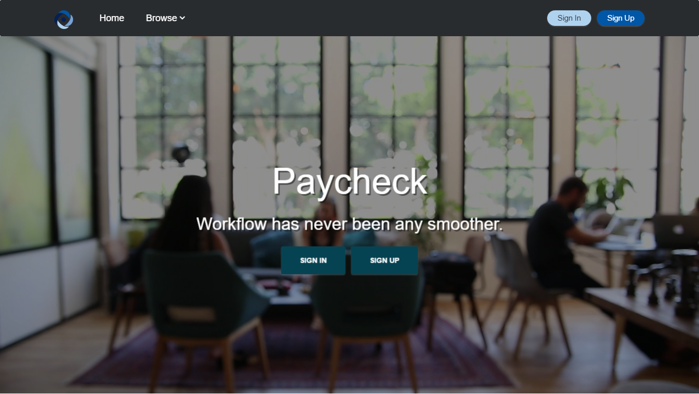

# [Paycheck](https://paycheck-app.herokuapp.com/)

[Video]()

Inspired by [Spotify's engineering culture](https://labs.spotify.com/2014/03/27/spotify-engineering-culture-part-1/)
and the description of Alphabet's Moonshot factory workflow and goals as seen in this [interview](http://www.wsj.com/video/astro-teller-on-moonshots-for-alphabet-x/CDC0A79C-CF6B-4FC8-9CF8-5C6A29C55551.html).
The desired effect being the ability to deploy resources ( people ) where they are needed the most at that point in time.

## Public - Projects
Projects open for contributions to the general public, reigstered users or not. Open to any sort of problems, DSA homework or the Ultimate Question of Life, the Universe, and Everything.

## Private - Organizations
The private section is structured around organizations. Organizations contain their private set of projects and users, differentiated by their role within the organization and also within each separate project, e.g. a manager of a certain project can also be assigned as a 
contributor in a separate one. 

## Architecture
- app.js: composing the application
  - routers: depend on controllers, each routers use depends on its own controller(s)
  - controllers: depend on one or more data objects to work with data
  - data: depend on models for accessing db collections
  - models: provide direct access to the data
  
## Notable dependencies
  - Socket.io: chat/ messaging 
  - Passport: facebook/ local authentication 
  - Validate.js: validation and sanitization
  - Crypto-js: client hashing  
  - Winston: logging
  

